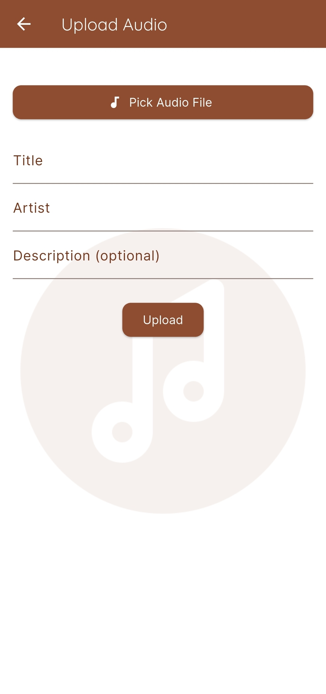

🎵 Audio Player App

A modern and fully functional 'Audio Player App' built using Flutter, Firebase,Cloudinary and Riverpod state management.
---

1.Features(functionalities)

-  Authentication functionality (SignUp and login)
-  Audio Listing free audios from firestore
-  Picking audio from local file
-  Upload your own audio to cloudinary
-  Play audio with controls
-  Profile with own audios and with logout

---

2. 📸 Screenshots

  <h3>Home Screen</h3>

<h3>Player Screen</h3>

<h3>Upload Screen</h3>

  <h3>Login Screen</h3>

 <h3>SignUp Screen</h3>

<h3>Profile Screen</h3>

---

3. Tech Stack

- Flutter 3.0+
- Firebase (Auth, Firestore,)
- Riverpod (for state management)
- Google Fonts for UI design
- Material Design + Theme customization

---

4. Installation

* Prerequisites
- Flutter SDK installed
- Firebase Project setup (with Android support)
- Emulator or physical Android device

* Steps
1. Clone this repo:
git clone https://github.com/ebroahmed/audio_player_app.git
cd audio_player_app

2.Install dependencies:
  flutter pub get

3.Configure Firebase:
Add your google-services.json to /android/app/
Enable Firebase Auth, Firestore and cloudinary

4.Run the app:
 flutter run

 📂 Project Structure Highlights
 
 lib/
 ├── models/
 ├── providers/
 ├── repositories/
 ├── screens/
       /auth
 ├── widgets/
 └── main.dart
 
* Deployment (APK)
   1. Run
      flutter build apk --release
   2. Find the APK at:
      build/app/outputs/flutter-apk/app-release.apk

Contact
If you'd like to collaborate, hire, or ask questions:

Ebrahim Ahmed
📧 [ebrahimahmed804853@gmail.com]
🔗 [Github (https://github.com/ebroahmed/)]    

Star ⭐ the repo if you found it helpful!
